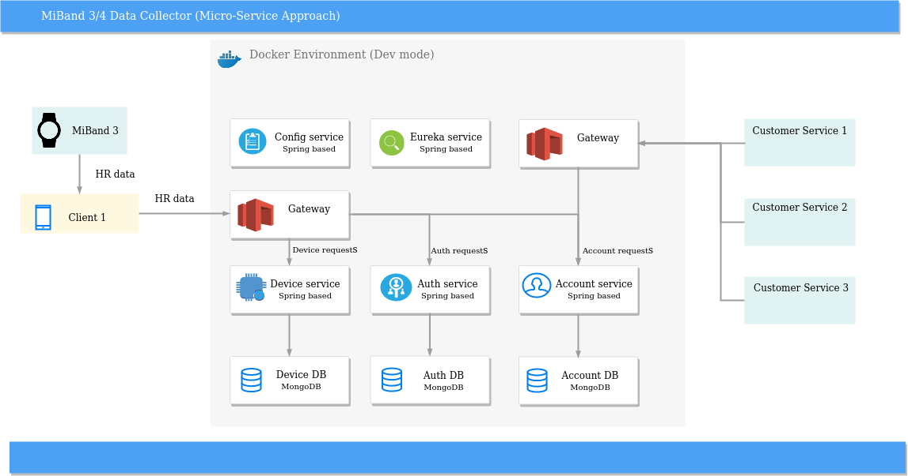

# B2G Server side

## Project status
The project has proof of concept state now.

## Description
Server side is going to be used for main processing of data comes from smartphones. All results will be kept 
on local data based. It will have two modes which define scenarious as follows:
1) keep processed data in some DB. In this case some game will have access to it.
2) keep processed data locally and send them to target game application by rest according to demand

### Stack of technologies
Following technologies will be used:
1) Java 8
2) Spring Boot
3) Spring Data
4) Spring REST
5) JUnit, Mockito
6) Maven
7) Docker

## Server Review
Main components of SBP are described below on scheme:

## How to get started

## How to use

## License
MIT