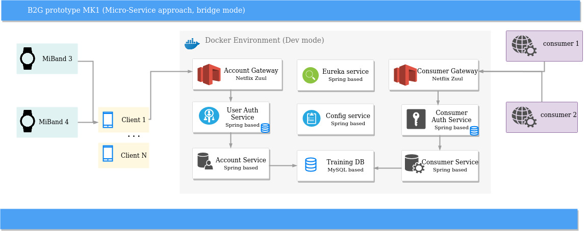
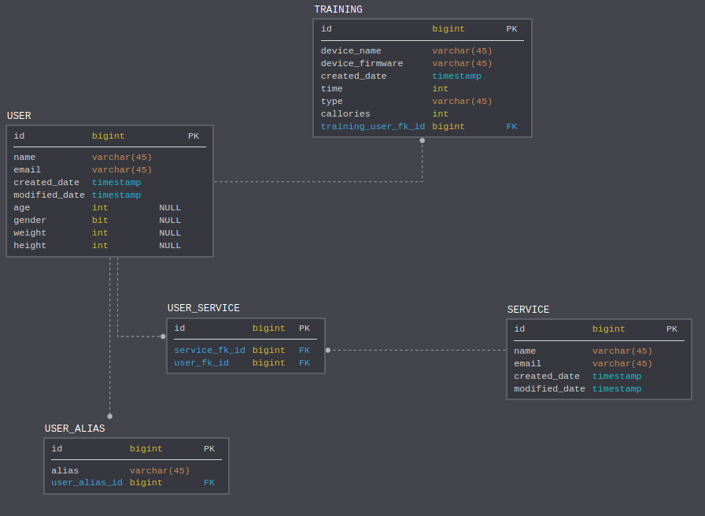

# H2G Server side

Server side is going to be used for main processing of data comes from smartphones. All results will be kept
on local data based. It will have two modes which define scenarios as follows:
1) keep processed data in some DB. In this case some game will have access to it.
2) keep processed data locally and send them to target game application by rest according to demand

## Project status
The project has proof of concept state now.

### Stack of technologies
Following technologies will be used:
1) Java 11 (OpenJDK)
2) Spring Boot (2.1.4.RELEASE)
3) Spring Data
4) Spring REST
5) JUnit, Mockito
6) Maven
7) Docker
8) Docker Compose (3.7)

## Server Review
Current server's concept looks like below:  

Data structure for Stage 1 looks like:  

## How to get started
1) Compile sources staying in project root folder by typing in terminal: mvn clean install
2) Enable Docker plugin (IDEA: settings -> plugins -> Docker)
3) Run docker-compose script by typing: sudo docker-compose -f ./docker-compose.yml -f ./docker-compose.dev.yml up
4) Check what docker plugin shows and check there running containers

## Links

## License
MIT
